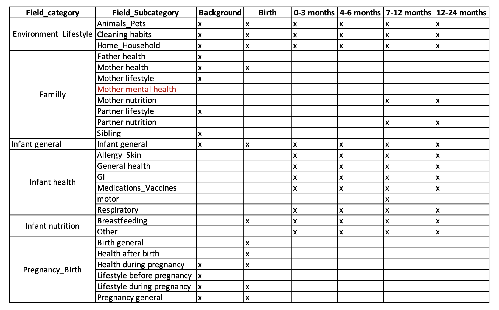

```{r, warning=FALSE, echo=FALSE, message=FALSE}
# libraries
library("readxl")
library("tidyverse")
library("ggridges")

# Load the spreadsheets
Voc <- read_excel("../questionnaire_vocabulary.xlsx")

Q1_max<-1055
Q1 <- read_csv("../normalized_versions/corrected_translated/Q1_norm_background_04.10.18.csv", guess_max=Q1_max) %>% 
  add_column(questionnaire="A_background")

Q2_max<-7242
Q2 <- read_csv("../normalized_versions/corrected_translated/Q2_norm_Previous3months_15.08.20.csv", guess_max=Q2_max) %>% 
  add_column(questionnaire="E_Previous3Months")

Q3_max<-6653
Q3 <- read_csv("../normalized_versions/corrected_translated/Q3_norm_4to6months_26.01.20.csv", guess_max=Q3_max) %>% 
  add_column(questionnaire="C_4to6months")

Q4_max<-5600
Q4 <- read_csv("../normalized_versions/corrected_translated/Q4_norm_7to12months_27.01.21.csv", guess_max=Q4_max) %>% 
  add_column(questionnaire="D_7to12months")

Q5y1_max<-431
Q5y2_max<-901
Q5y1B_max<-532
Q5y2B_max<-6
Q5y1 <- read_csv("../normalized_versions/corrected_translated/Q5_norm_NutritionMotorDev_v2_yearI_28.01.21.csv", guess_max=Q5y1_max) %>% 
  add_column(questionnaire="F1_NutritionMotorDev_year1_Version2")
Q5y2 <- read_csv("../normalized_versions/corrected_translated/Q5_norm_NutritionMotorDev_v2_yearII_28.01.21.csv", guess_max=Q5y2_max) %>% 
  add_column(questionnaire="F2_NutritionMotorDev_year2_Version2")
Q5y1B <- read_csv("../normalized_versions/corrected_translated/Q5_norm_NutritionMotorDev_yearI_27.01.21.csv", guess_max=Q5y1B_max) %>%
  add_column(questionnaire="F1_NutritionMotorDev_year1_Version1")
Q5y2B <- read_csv("../normalized_versions/corrected_translated/Q5_norm_NutritionMotorDev_yearII_28.01.21.csv", guess_max=Q5y2B_max) %>% 
  add_column(questionnaire="F2_NutritionMotorDev_year2_Version1")

Q6F_max<-1018
Q6M_max<-1357
Q6F <- read_csv("../normalized_versions/corrected_translated/Q6_norm_ParentsF_FoodFrequency_28.01.21.csv", guess_max=Q6F_max) %>% 
  add_column(questionnaire="G_ParentF_FoodFrequency")
Q6M <- read_csv("../normalized_versions/corrected_translated/Q6_norm_ParentsM_FoodFrequency_28.01.21.csv", guess_max=Q6M_max) %>% 
  add_column(questionnaire="G_ParentM_FoodFrequency")

Q7_max<-683
Q7 <- read_csv("../normalized_versions/corrected_translated/Q7_norm_depression_unkown.csv", guess_max=Q7_max) %>% 
  add_column(questionnaire="G_MotherDepression")

Q8_max<-268
Q8 <- read_csv("../normalized_versions/corrected_translated/Q8_norm_HouseDustCollection_28.01.21.csv", guess_max=Q8_max) %>% 
  add_column(questionnaire="H_HouseCollection")

Q9_max<-16953
Q9 <- read_csv("../normalized_versions/corrected_translated/Q9_norm_0to3 months_02.02.2020.csv", guess_max=Q9_max) %>% 
  add_column(questionnaire="B_0to3months")

Q10y0_max<-1076
Q10y2_max<-689
Q10y0 <- read_csv("../normalized_versions/corrected_translated/Q10_norm_MotherStress_Year0_02.09.21.csv", guess_max=Q10y0_max) %>% 
  add_column(questionnaire="G0_MotherStress")
Q10y2 <- read_csv("../normalized_versions/corrected_translated/Q10_norm_MotherStress_Year2_02.09.21.csv", guess_max=Q10y2_max) %>% 
  add_column(questionnaire="G2_MotherStress")

```

# Goals and objectives: 
This documents aims to provide an overview on the HELMi contextual dataset extracted from the families questionnaires.

The following aspects are considered: 

- Types and sparcity of the contextual dataset

- Family compliance

# Dataset description:

**infants questionnaires:**

- A_background
 
- F1_NutritionMotorDev_year1_version1 or F1_NutritionMotorDev_year1_version2
 
- F2_NutritionMotorDev_year2_version1 or F2_NutritionMotorDev_year2_version2
 

**infants frequency questionnaires:**

- E_Previous3Months
 
- C_4to6months
 
- D_7to12months
 
- B_0to3months

**parents questionnaires:**

- G_ParentF_FoodFrequency
 
- G_ParentM_FoodFrequency
 
- G_MotherDepression
 
- G0_MotherStress and G2_MotherStress

**Other questionnaires:**

- H_HouseCollection

 
\pagebreak 

# General overview

## Types of Metadata

Overview of the type of metadata in each questionnaire. Note that "mult_categorical" corresponds to multiple choice categories.

```{r, echo=FALSE}
#types counts
Types_count <- Voc %>% group_by(Questionnaire, data_type) %>% tally()
#Types_count$Questionnaire <- sort(as.factor(Types_count$Questionnaire), decreasing=TRUE)

plotTypes <- Types_count %>% ggplot(aes(x=Questionnaire, y=n, fill=data_type)) +
  geom_bar(stat="identity")+
  coord_flip() +
  theme(legend.position="bottom",
        text = element_text(size=10))

plotTypes 
```
\pagebreak 

## Usability of Metadata
Overview of the direct usability of the contextual dataset. "TO CURATE" indicates fields where a manual extraction of the data would be vaulable. "TO CORRECT" indicates fields where a conversion or type correction would be valuable. "CORRECTED" indicates a field where the data was converted or corrected in a major way (this do not include the simple category translation).

```{r, echo=FALSE}
#Usability counts
Usability_count <- Voc %>% group_by(Questionnaire, usability) %>% tally()

plotUsa <- Usability_count %>% ggplot(aes(x=Questionnaire, y=n, fill=usability)) +
  geom_bar(stat="identity")+
  coord_flip() +
  theme(legend.position="bottom",
        text = element_text(size=10))
plotUsa 
```
\pagebreak 

# Questionnaire sparcity

Looking at the number of NA per column in each questionnaire

```{r, echo=FALSE}

na_Q1 <-sapply(Q1, function(y) sum(length(which(is.na(y)))))
na_Q1 <- data.frame(na_Q1) %>% rename("nb_na"="na_Q1")
naC_Q1 <- na_Q1 %>% mutate(percent_na=nb_na/nrow(Q1)) %>% 
  add_column(questionnaire="background") %>% select(questionnaire, percent_na)
all_nac <- naC_Q1

na_Q2 <-sapply(Q2, function(y) sum(length(which(is.na(y)))))
na_Q2 <- data.frame(na_Q2) %>% rename("nb_na"="na_Q2")
naC_Q2 <- na_Q2 %>% mutate(percent_na=nb_na/nrow(Q2)) %>% 
  add_column(questionnaire="Previous3months")  %>% select(questionnaire, percent_na)
all_nac <- bind_rows(all_nac, naC_Q2)

na_Q3 <-sapply(Q3, function(y) sum(length(which(is.na(y)))))
na_Q3 <- data.frame(na_Q3) %>% rename("nb_na"="na_Q3")
naC_Q3 <- na_Q3 %>% mutate(percent_na=nb_na/nrow(Q3)) %>% 
  add_column(questionnaire="4to6months") %>% select(questionnaire, percent_na)
all_nac <- bind_rows(all_nac, naC_Q3)

na_Q4 <-sapply(Q4, function(y) sum(length(which(is.na(y)))))
na_Q4 <- data.frame(na_Q4) %>% rename("nb_na"="na_Q4")
naC_Q4 <- na_Q4 %>% mutate(percent_na=nb_na/nrow(Q4)) %>% 
  add_column(questionnaire="7to12months") %>% select(questionnaire, percent_na)
all_nac <- bind_rows(all_nac, naC_Q4)

na_Q5y1 <-sapply(Q5y1, function(y) sum(length(which(is.na(y)))))
na_Q5y1 <- data.frame(na_Q5y1) %>% rename("nb_na"="na_Q5y1")
naC_Q5y1 <- na_Q5y1 %>% mutate(percent_na=nb_na/nrow(Q5y1)) %>% 
  add_column(questionnaire="NutritionMotorDev_year1_Version2") %>% select(questionnaire, percent_na)
all_nac <- bind_rows(all_nac, naC_Q5y1)

na_Q5y2 <-sapply(Q5y2, function(y) sum(length(which(is.na(y)))))
na_Q5y2 <- data.frame(na_Q5y2) %>% rename("nb_na"="na_Q5y2")
naC_Q5y2 <- na_Q5y2 %>% mutate(percent_na=nb_na/nrow(Q5y2)) %>% 
  add_column(questionnaire="NutritionMotorDev_year2_Version2") %>% select(questionnaire, percent_na)
all_nac <- bind_rows(all_nac, naC_Q5y2)

na_Q5y1B <-sapply(Q5y1B, function(y) sum(length(which(is.na(y)))))
na_Q5y1B <- data.frame(na_Q5y1B) %>% rename("nb_na"="na_Q5y1B")
naC_Q5y1B <- na_Q5y1B %>% mutate(percent_na=nb_na/nrow(Q5y1B)) %>%
  add_column(questionnaire="NutritionMotorDev_year1_Version1") %>% select(questionnaire, percent_na)
all_nac <- bind_rows(all_nac, naC_Q5y1B)

na_Q5y2B <-sapply(Q5y2B, function(y) sum(length(which(is.na(y)))))
na_Q5y2B <- data.frame(na_Q5y2B) %>% rename("nb_na"="na_Q5y2B")
naC_Q5y2B <- na_Q5y2B %>% mutate(percent_na=nb_na/nrow(Q5y2B)) %>% 
  add_column(questionnaire="NutritionMotorDev_year2_Version1") %>% select(questionnaire, percent_na)
all_nac <- bind_rows(all_nac, naC_Q5y2B)

na_Q6F <-sapply(Q6F, function(y) sum(length(which(is.na(y)))))
na_Q6F <- data.frame(na_Q6F) %>% rename("nb_na"="na_Q6F")
naC_Q6F <- na_Q6F %>% mutate(percent_na=nb_na/nrow(Q6F)) %>% 
  add_column(questionnaire="ParentF_FoodFrequency") %>% select(questionnaire, percent_na)
all_nac <- bind_rows(all_nac, naC_Q6F)

na_Q6M <-sapply(Q6M, function(y) sum(length(which(is.na(y)))))
na_Q6M <- data.frame(na_Q6M) %>% rename("nb_na"="na_Q6M")
naC_Q6M <- na_Q1 %>% mutate(percent_na=nb_na/nrow(Q6M)) %>% 
  add_column(questionnaire="ParentM_FoodFrequency") %>% select(questionnaire, percent_na)
all_nac <- bind_rows(all_nac, naC_Q6M)

na_Q7 <-sapply(Q7, function(y) sum(length(which(is.na(y)))))
na_Q7 <- data.frame(na_Q7) %>% rename("nb_na"="na_Q7")
naC_Q7 <- na_Q7 %>% mutate(percent_na=nb_na/nrow(Q7)) %>% 
  add_column(questionnaire="MotherDepression") %>% select(questionnaire, percent_na)
all_nac <- bind_rows(all_nac, naC_Q7)

na_Q8 <-sapply(Q8, function(y) sum(length(which(is.na(y)))))
na_Q8 <- data.frame(na_Q8) %>% rename("nb_na"="na_Q8")
naC_Q8 <- na_Q8 %>% mutate(percent_na=nb_na/nrow(Q8)) %>% 
  add_column(questionnaire="HouseCollection") %>% select(questionnaire, percent_na)
all_nac <- bind_rows(all_nac, naC_Q8)

na_Q9 <-sapply(Q9, function(y) sum(length(which(is.na(y)))))
na_Q9 <- data.frame(na_Q9) %>% rename("nb_na"="na_Q9")
naC_Q9 <- na_Q9 %>% mutate(percent_na=nb_na/nrow(Q9)) %>% 
  add_column(questionnaire="0to3months") %>% select(questionnaire, percent_na)
all_nac <- bind_rows(all_nac, naC_Q9)

na_Q10y0 <-sapply(Q10y0, function(y) sum(length(which(is.na(y)))))
na_Q10y0 <- data.frame(na_Q10y0) %>% rename("nb_na"="na_Q10y0")
na_Q10y0 <- na_Q10y0 %>% mutate(percent_na=nb_na/nrow(Q10y0)) %>% 
  add_column(questionnaire="G0_MotherStress") %>% select(questionnaire, percent_na)
all_nac <- bind_rows(all_nac, na_Q10y0)

na_Q10y2 <-sapply(Q10y2, function(y) sum(length(which(is.na(y)))))
na_Q10y2 <- data.frame(na_Q10y2) %>% rename("nb_na"="na_Q10y2")
na_Q10y2 <- na_Q10y2 %>% mutate(percent_na=nb_na/nrow(Q10y2)) %>% 
  add_column(questionnaire="G2_MotherStress") %>% select(questionnaire, percent_na)
all_nac <- bind_rows(all_nac, na_Q10y2)

# Boxplot Na percentages
all_nac$questionnaire <- as.factor(all_nac$questionnaire)

#violin_plot<- all_nac %>% ggplot(aes(x=questionnaire, y=percent_na, fill=questionnaire)) +
#    geom_violin() +
#    theme(
#      legend.position="none",
#      plot.title = element_text(size=11)
#    ) +
#    xlab("") + coord_flip()
#violin_plot

ridge_plot <- all_nac %>% ggplot(aes(x=percent_na, y=questionnaire, fill=questionnaire))+
  geom_density_ridges() +
  theme_ridges() + 
  theme(legend.position = "none")

ridge_plot
```
\pagebreak 

# Familly compliance

## Compliance overview
```{r, echo=FALSE}
# nb of famillies answers in each questionnaires
Q1_fam <- Q1 %>% group_by(questionnaire, familly_ID) %>% tally() %>% ungroup()
Q2_fam <- Q2 %>% group_by(questionnaire, familly_ID) %>% tally() %>% ungroup()
Q3_fam <- Q3 %>% group_by(questionnaire, familly_ID) %>% tally() %>% ungroup()
Q4_fam <- Q4 %>% group_by(questionnaire, familly_ID) %>% tally() %>% ungroup()
Q5y1_fam <- Q5y1 %>% group_by(questionnaire, familly_ID) %>% tally() %>% ungroup()
Q5y2_fam <- Q5y2 %>% group_by(questionnaire, familly_ID) %>% tally() %>% ungroup()
Q5y1B_fam <- Q5y1B %>% group_by(questionnaire, familly_ID) %>% tally() %>% ungroup()
Q5y2B_fam <- Q5y2B %>% group_by(questionnaire, familly_ID) %>% tally() %>% ungroup()
Q6F_fam <- Q6F %>% group_by(questionnaire, familly_ID) %>% tally() %>% ungroup()
Q6M_fam <- Q6M %>% group_by(questionnaire, familly_ID) %>% tally() %>% ungroup()
Q7_fam <- Q7 %>% group_by(questionnaire, familly_ID) %>% tally() %>% ungroup()
Q8_fam <- Q8 %>% group_by(questionnaire, familly_ID) %>% tally() %>% ungroup()
Q9_fam <- Q9 %>% group_by(questionnaire, familly_ID) %>% tally() %>% ungroup()
Q10y0_fam <- Q10y0 %>% group_by(questionnaire, familly_ID) %>% tally() %>% ungroup()
Q10y2_fam <- Q10y2 %>% group_by(questionnaire, familly_ID) %>% tally() %>% ungroup()

all_fam <- Q1_fam %>% add_row(Q2_fam) %>% 
  add_row(Q3_fam) %>% 
  add_row(Q4_fam) %>% 
  add_row(Q5y1_fam) %>% 
  add_row(Q5y2_fam) %>% 
  add_row(Q5y1B_fam) %>% 
  add_row(Q5y2B_fam) %>% 
  add_row(Q6F_fam) %>% 
  add_row(Q6M_fam) %>% 
  add_row(Q7_fam) %>% 
  add_row(Q8_fam) %>% 
  add_row(Q9_fam) %>%
  add_row(Q10y0_fam) %>% 
  add_row(Q10y2_fam) %>% 
  rename("nb_filled"="n")

nb_fam <- all_fam %>% select(questionnaire, familly_ID) %>% unique() %>% 
  group_by(questionnaire) %>% tally() %>% ungroup() %>% rename("nb of famillies"="n")

knitr::kable(nb_fam, caption = 'number of famillies answering the questionnaire at least once')

```

```{r, echo=FALSE}
plot_comp <- all_fam %>% group_by(questionnaire, nb_filled) %>% tally() %>% rename("nb_famillies"="n") %>%
  ungroup()

plot_comp$nb_filled = as.factor(plot_comp$nb_filled )

plotComp <- plot_comp %>% ggplot(aes(x=questionnaire, y=nb_famillies, fill=nb_filled)) +
  geom_bar(stat="identity")+
  coord_flip() + 
  scale_fill_discrete(name = "Number of questionnaires answered") +
  theme(legend.position="bottom",
        text = element_text(size=10))
  
plotComp

```
## Family compliance in questionnaires

overview per familly: Famillies answering all the regular questionnaires

```{r, echo=FALSE}
# looking at the number of families filling the regular questionnaires

all_fam_wide <- all_fam %>% pivot_wider(names_from=questionnaire, values_from=nb_filled) %>% replace(is.na(.), 0) %>%
  mutate(F1_NutritionMotorDev_year1=F1_NutritionMotorDev_year1_Version2+F1_NutritionMotorDev_year1_Version1)%>%
  mutate(F2_NutritionMotorDev_year2=F2_NutritionMotorDev_year2_Version2+F2_NutritionMotorDev_year2_Version1) %>%
  select(-F1_NutritionMotorDev_year1_Version2, -F1_NutritionMotorDev_year1_Version1, - F2_NutritionMotorDev_year2_Version2, - F2_NutritionMotorDev_year2_Version1)

#infants questionnaires (background, Nutrition/Motor year 1 and 2)
all_fam_wide <- all_fam_wide %>% mutate(all_inf=A_background+F1_NutritionMotorDev_year1+F2_NutritionMotorDev_year2)

#infants frequency questionnaires: (E_Previous3Months, C_4to6months, D_7to12months, B_0to3months)
all_fam_wide <- all_fam_wide %>% mutate(all_reg=E_Previous3Months+C_4to6months+
                                          D_7to12months+B_0to3months)

#parents questionnaires: (G_ParentF_FoodFrequency, G_ParentM_FoodFrequency, G_MotherDepression, G_MotherStress)
all_fam_wide <- all_fam_wide %>% mutate(all_parents=G_ParentF_FoodFrequency+G_ParentM_FoodFrequency+
                                          G_MotherDepression + G0_MotherStress + G2_MotherStress)

# all main questionnaires
all_fam_wide <- all_fam_wide %>% mutate(all_main=all_inf+all_reg+all_parents)

## output table
max_inf <- all_fam_wide %>% filter(all_inf==3) %>% tally() %>%
  rename("all infants"="n")
max_reg <- all_fam_wide %>% filter(all_reg==38) %>% tally()%>%
  rename("all infants frequency"="n")
max_parents <- all_fam_wide %>% filter(all_parents==5) %>% tally()%>%
  rename("all parents"="n")
max_all <- all_fam_wide %>% filter(all_main==48) %>% tally()%>%
  rename("all major questionnaires"="n")
max_infreg <- all_fam_wide %>% filter(all_reg==38 & all_inf==3) %>% tally()%>%
  rename("all major infants and frequency"="n")
most_infreg <- all_fam_wide %>% filter(all_reg>=35 & all_inf==3) %>% tally()%>%
  rename("all major infants and most frequency"="n")

table_out <- max_inf %>% add_column(max_reg) %>% 
  add_column(max_parents) %>% 
  add_column(max_all) %>% 
  add_column(max_infreg) %>% 
  add_column(most_infreg) %>%
  pivot_longer(everything(), names_to="measures", values_to="nb families")

knitr::kable(table_out)


```


